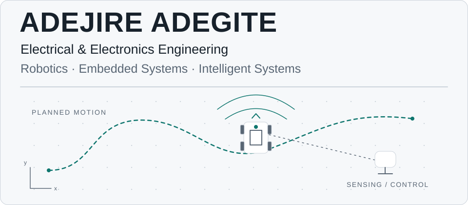
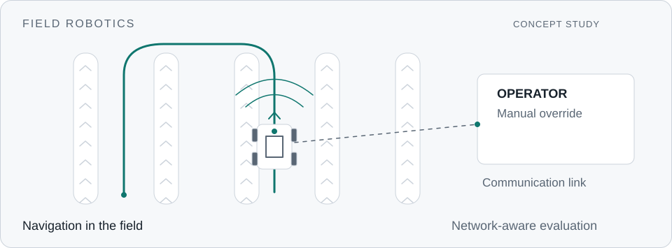
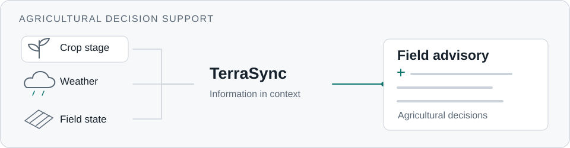
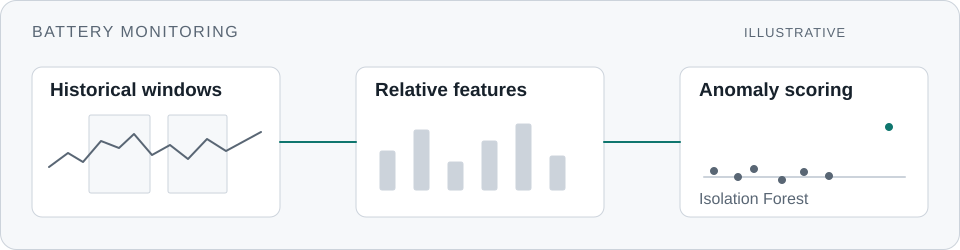
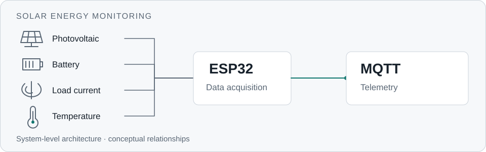

<picture>
  <source media="(prefers-color-scheme: dark)" srcset="assets/hero-dark.svg">
  
</picture>

Building intelligent systems that sense, reason, and operate in the physical world.

I'm an Electrical & Electronics Engineering student at FUTA building at the intersection of robotics, embedded systems, and intelligent systems. My work ranges from autonomous field robots and sensor-driven IoT systems to edge intelligence and agricultural decision support.

I'm particularly interested in engineering problems where hardware, software, and the physical world have to work together.

## Selected Engineering Work

### Agricultural Field Scouting Robot

*Final Year Research · 2026*

<picture>
  <source media="(prefers-color-scheme: dark)" srcset="assets/projects/field-robot-dark.svg">
  
</picture>

A dual-mode agricultural UGV combining autonomous navigation with manual override. Final-year research evaluates how network constraints affect robot operation, with an emphasis on navigation and control in field conditions.

**Technologies:** ROS 2 · Nav2 · Gazebo · RViz · Python

[Explore the repository](https://github.com/AdejireA/ros2-farm-scout-FYP)

### TerraSync

*Product Development · 2026*

<picture>
  <source media="(prefers-color-scheme: dark)" srcset="assets/projects/terrasync-dark.svg">
  
</picture>

An agricultural decision-support platform combining crop-stage, weather, and field information into actionable guidance for smallholder farmers. The product focus is making agricultural information useful in day-to-day decisions.

**Technologies:** Django · Python · Weather Data · Agricultural Decision Support

### Solar Battery Anomaly Detection

*Research Project · 2026*

<picture>
  <source media="(prefers-color-scheme: dark)" srcset="assets/projects/battery-anomaly-dark.svg">
  
</picture>

Lightweight, label-free anomaly detection for off-grid solar batteries using Isolation Forest and battery-relative historical features, designed with edge-oriented monitoring constraints in mind. This reduces dependence on labelled fault datasets for monitoring.

**Technologies and methods:** Python · Isolation Forest · Historical features · Machine learning

[Explore the repository](https://github.com/AdejireA/battery-anomaly-edge)

### Solar Energy Monitoring System

*Embedded Systems Project*

<picture>
  <source media="(prefers-color-scheme: dark)" srcset="assets/projects/solar-monitoring-dark.svg">
  
</picture>

An ESP32-based solar monitoring system connecting photovoltaic, battery, load-current, and temperature sensing with MQTT telemetry, with an emphasis on sensor integration and embedded data acquisition.

**Technologies:** ESP32 · INA226 · SCT-013 · DS18B20 · MQTT · C/C++

[Explore the repository](https://github.com/AdejireA/solar-energy-monitoring-system)

## Engineering Capabilities

| Robotics & Autonomy | Embedded & IoT |
| --- | --- |
| ROS 2 · Nav2 · Gazebo · RViz | ESP32 · C/C++ · MQTT · Sensors |
| **Software & Intelligence** | **Tools & Environment** |
| Python · Django · Machine Learning · OpenCV | Linux · Git · GitHub · MATLAB |

## Research Directions

Field Robotics · Autonomous Systems · Network-Constrained Robotics · Edge Intelligence · Agricultural Technology

GeoAI and Earth observation are emerging areas of exploration, particularly in relation to agricultural resilience.

## Engineering & Community

**Smart Systems Research Laboratory, FUTA**

Research, hardware development, and laboratory work on student engineering projects spanning embedded systems, robotics, IoT, and intelligent systems.

**IEEE FUTA Student Branch**

Technical community building, engineering programmes, and student professional development.

## Writing & Contact

I document engineering work, including what breaks and what I learn while fixing it. Read my writing on [Medium](https://medium.com/@adegite-adejire) and [Hashnode](https://hashnode.com/@adegite-adejire).

[LinkedIn](https://linkedin.com/in/adegite-adejire) · [GitHub](https://github.com/AdejireA) · [X](https://x.com/AdejireA)
